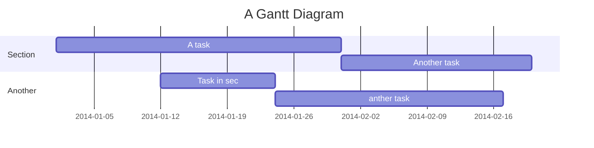

# Few Shot Facial Recognition 

<p align="center">
    
</p>
    
<!-- 

 -->

## Table of Contents

[TOC]

## What is this ?

The need for capable facial recognition systems is
increasing every day, as new applications for the technology
are found - from security and surveillance to self-driving cars.

One unique requirement for facial recognition that sets it apart from other AI problems is the relatively small datasets it is
expected to work with; anyone who needs a facial recognition
system to recognize them would not be willing to provide
more than a few images. With this, the computer is expected to
learn how to accurately identify that person under a wide
range of lighting conditions, facial expressions, hairstyles, etc.
That type of machine learning - where a model uses a small
number of examples to cover a wide range of inputs - is
referred to as few-shot learning, and was the focus of this
project.

In short, a dataset of labeled face images was used, with
only a few training images per label. Then, image
augmentation was used to effectively create more training
data. Then, different models were created and trained on the
training data. The models were then used to make predictions
for the test data, and various performance metrics were
recorded. The models were then refined and experimented
with to achieve the best results. This process is elaborated on
further below.


Dataset
---

To achieve this, the publicly available CelebA dataset is used.


Over 253 different people was used.

For each person, 5 images were picked at random for the training dataset, and 3 were picked for the test dataset.

Executable Files: `prepData.js`
 

The dataset as downloaded from source has too many images per person and does not have a structure suitable for our use.

This file is a Node.js script that picks out a few train/test images per person, and arranges them in a folder hierarchy that makes the dataset easier to use.

Note that after running this code, the dataset still contains images for 10,000 people. For practical reasons, we manually reduced this down to 253 people by deleting the folders for all the others. The first 253 folders in numerical order (by name) were retained. This does not have any code associated with it as it was done manually.

All the follwing Python code assumed the dataset has been run through this script.


Image augmentation was performed on the training dataset,
where 9 new images were derived from each original image.
The original train dataset was then split into train and
evaluation (‘eval’) sets, at a 70/30 ratio. The eval set was
meant to be used to evaluate model performance during
training.

Aside from the train and test dataset, an ‘other’ dataset was also prepared. This contained images of people that did not exist in the training dataset, and so could never be identified by any trained model. The purpose of this dataset was to ensure that the models could correctly predict when an image had an unknown face in it, rather than reporting a false positive for any existing label. This is important since
identifying strangers is a critical feature for any security
system that uses facial recognition. During training, this
‘other’set was to be appended to the eval set and used to tune
the models.
Finally, the images in all datasets needed to be turned into
a standardized numerical format that the models could work
with. To do this, two pre-trained models were used as
described in the following sections. Any images that failed to
go through this process were discarded.
At this point, the dataset was ready to be used. It had the
train, test, and eval (+ ‘other’) subsets with 7023, 900, and
3724 images respectively, and consisted of face embeddings
for the faces in the original images.


> I choose a lazy person to do a hard job. Because a lazy person will find an easy way to do it. [name=Bill Gates]


```gherkin=
Feature: Shopping Cart
  As a Shopper
  I want to put items in my shopping cart
  Because I want to manage items before I check out

  Scenario: User adds item to cart
    Given I'm a logged-in User
    When I go to the Item page
    And I click "Add item to cart"
    Then the quantity of items in my cart should go up
    And my subtotal should increment
    And the warehouse inventory should decrement
```

> Read more about Gherkin here: https://docs.cucumber.io/gherkin/reference/

User flows
---
```sequence
Alice->Bob: Hello Bob, how are you?
Note right of Bob: Bob thinks
Bob-->Alice: I am good thanks!
Note left of Alice: Alice responds
Alice->Bob: Where have you been?
```

> Read more about sequence-diagrams here: http://bramp.github.io/js-sequence-diagrams/

Project Timeline
---


> Read more about mermaid here: http://mermaid-js.github.io/mermaid/

## Appendix and FAQ

:::info
**Find this document incomplete?** Leave a comment!
:::

###### tags: `Templates` `Documentation`


Below is a brief explanation of each file.

## `prepData.js`
The dataset as downloaded from source has too many images per person and does not have a structure suitable for our use.

This file is a Node.js script that picks out a few train/test images per person, and arranges them in a folder hierarchy that makes the dataset easier to use.

Note that after running this code, the dataset still contains images for 10,000 people. For practical reasons, we manually reduced this down to 253 people by deleting the folders for all the others. The first 253 folders in numerical order (by name) were retained. This does not have any code associated with it as it was done manually.

All the follwing Python code assumed the dataset has been run through this script.

## `augmentation.py`
This file contains code for image augmentation.

## `few_shot_face_recogntion.py`
This file contains functions to load the data, split it into train/test/eval, extract face embeddings, and perform other steps (excluding image augmentation) as described in the report. It also contains functions to run the first two methods described in the report that involve Euclidean distances.

Finally, the code at the end of the file uses the aforementioned functions to run experiments and show results for the first 2 methods.

## `svm_fewshot.py`
This file contains (aside from some helper functions identical to those in the previous file) all the code related to the third "Stacked SVM" method from our report. Running this file will perform the training, testing, and will generate results.

## `analysis.py`
This file contains code that analyses the dataset in various ways as discussed in the report. This includes generating plots to visualize data samples, probability distributions, etc.

## Other Notes
The original dataset (and associated .txt files) can be downloaded from: http://mmlab.ie.cuhk.edu.hk/projects/CelebA.html

The specific implementation of FaceNet we used (the `facenet_keras.h5` file) can be found here: https://drive.google.com/file/d/1PZ_6Zsy1Vb0s0JmjEmVd8FS99zoMCiN1/view?usp=sharing
