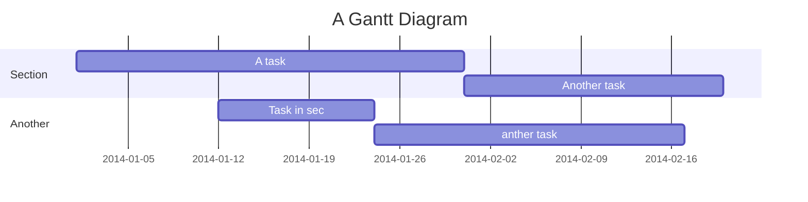

# Few Shot Facial Recognition


    


## Table of Contents

[TOC]

## Beginners Guide

If you are a total beginner to this, start here!

1. Visit hackmd.io
2. Click "Sign in"
3. Choose a way to sign in
4. Start writing note!

User story
---

```gherkin=
Feature: Guess the word

  # The first example has two steps
  Scenario: Maker starts a game
    When the Maker starts a game
    Then the Maker waits for a Breaker to join

  # The second example has three steps
  Scenario: Breaker joins a game
    Given the Maker has started a game with the word "silky"
    When the Breaker joins the Maker's game
    Then the Breaker must guess a word with 5 characters
```
> I choose a lazy person to do a hard job. Because a lazy person will find an easy way to do it. [name=Bill Gates]


```gherkin=
Feature: Shopping Cart
  As a Shopper
  I want to put items in my shopping cart
  Because I want to manage items before I check out

  Scenario: User adds item to cart
    Given I'm a logged-in User
    When I go to the Item page
    And I click "Add item to cart"
    Then the quantity of items in my cart should go up
    And my subtotal should increment
    And the warehouse inventory should decrement
```

> Read more about Gherkin here: https://docs.cucumber.io/gherkin/reference/

User flows
---
```sequence
Alice->Bob: Hello Bob, how are you?
Note right of Bob: Bob thinks
Bob-->Alice: I am good thanks!
Note left of Alice: Alice responds
Alice->Bob: Where have you been?
```

> Read more about sequence-diagrams here: http://bramp.github.io/js-sequence-diagrams/

Project Timeline
---


> Read more about mermaid here: http://mermaid-js.github.io/mermaid/

## Appendix and FAQ

:::info
**Find this document incomplete?** Leave a comment!
:::

###### tags: `Templates` `Documentation`


Below is a brief explanation of each file.

## `prepData.js`
The dataset as downloaded from source has too many images per person and does not have a structure suitable for our use.

This file is a Node.js script that picks out a few train/test images per person, and arranges them in a folder hierarchy that makes the dataset easier to use.

Note that after running this code, the dataset still contains images for 10,000 people. For practical reasons, we manually reduced this down to 253 people by deleting the folders for all the others. The first 253 folders in numerical order (by name) were retained. This does not have any code associated with it as it was done manually.

All the follwing Python code assumed the dataset has been run through this script.

## `augmentation.py`
This file contains code for image augmentation.

## `few_shot_face_recogntion.py`
This file contains functions to load the data, split it into train/test/eval, extract face embeddings, and perform other steps (excluding image augmentation) as described in the report. It also contains functions to run the first two methods described in the report that involve Euclidean distances.

Finally, the code at the end of the file uses the aforementioned functions to run experiments and show results for the first 2 methods.

## `svm_fewshot.py`
This file contains (aside from some helper functions identical to those in the previous file) all the code related to the third "Stacked SVM" method from our report. Running this file will perform the training, testing, and will generate results.

## `analysis.py`
This file contains code that analyses the dataset in various ways as discussed in the report. This includes generating plots to visualize data samples, probability distributions, etc.

## Other Notes
The original dataset (and associated .txt files) can be downloaded from: http://mmlab.ie.cuhk.edu.hk/projects/CelebA.html

The specific implementation of FaceNet we used (the `facenet_keras.h5` file) can be found here: https://drive.google.com/file/d/1PZ_6Zsy1Vb0s0JmjEmVd8FS99zoMCiN1/view?usp=sharing